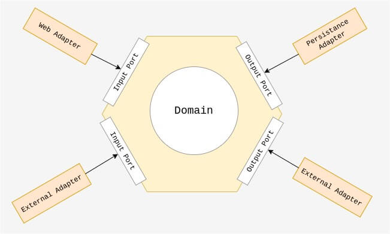

# Architecture Hexagonale (Ports & Adapters)

## Définition courte
L'architecture hexagonale isole le cœur applicatif (domaine + cas d'usage) des détails techniques. Le noyau expose des « ports » (interfaces) et des « adapters » (implémentations) se branchent dessus : UI, API, base de données, tests, etc. Cela rend l'application testable, remplaçable et indépendante des frameworks.

## Caractéristiques principales
- Séparation claire inside/outside (coeur vs périphérie).
- Ports = contrats/abstractions ; Adapters = implémentations concrètes.
- Driving adapters (UI, REST, CLI) et driven adapters (DB, cache, services externes).
- Facilite les tests (mocks/in-memory) et le développement isolé.
- Encourage DIP / injection de dépendances.
- Permet d'exécuter l'app en mode headless (API pour scripts/tests).

## Schéma simple

## Exemples d'implémentation (très court)
1. Extraire la logique métier dans des services/pure functions.
2. Définir des interfaces (ports) pour chaque interaction externe (ex. OrderPort, PaymentPort).
3. Implémenter des adapters concrets (REST controller, repository JPA, client HTTP) et des mocks pour les tests.
4. Composer au démarrage via DI (constructor injection) pour brancher les adapters aux ports.

## Usages connus
- Pattern proposé par Alistair Cockburn (article original) et largement repris dans les projets DDD / microservices.
- Nombreux tutoriels et exemples open-source (dépôts démonstratifs) montrent l'approche appliquée à des APIs REST + persistence.

## Sources
- Alistair Cockburn — Hexagonal Architecture (Ports & Adapters) : https://alistair.cockburn.us/hexagonal-architecture
- Exemples/démos sur GitHub (rechercher « hexagonal architecture ») : https://github.com/reflectoring/hexagonal-architecture