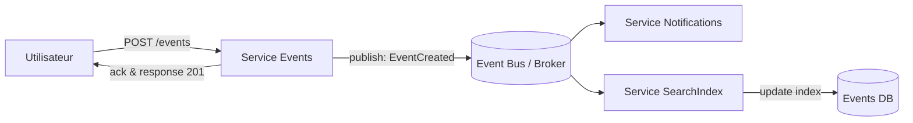

# Architecture Event-Driven

## Définition
Une architecture reposant sur des événements : des émetteurs publient des événements sur un bus, et des consommateurs y réagissent de façon asynchrone.

## Caractéristiques
- Découplage fort entre producteurs et consommateurs
- Traitement asynchrone et par lots possible
- Bonne extensibilité (ajout de consommateurs)
- Nécessite un bus (RabbitMQ, Kafka, etc.) ou broker

## Schéma (Mermaid)

## Chemin: « Un utilisateur consulte la liste des événements »
Cas synchronisé (lecture):
1. L'utilisateur envoie GET `/events` au Service Events (ou via API Gateway).
2. Le Service Events interroge sa base de données EventsDB et retourne la liste.

Cas création (exemple d'émission d'événement):
1. L'utilisateur crée un événement via POST `/events`.
2. Le Service Events persiste l'événement puis publie `EventCreated` sur le bus.
3. Les consommateurs (Notifications, SearchIndex, Analytics) reçoivent l'événement et effectuent leurs traitements (envoi d'email, mise à jour d'index, etc.).

## Avantages / Inconvénients
- Avantages : découplage, scalabilité et flexibilité pour ajouter des fonctionnalités asynchrones.
- Inconvénients : complexité (gestion du broker, garantie d'acheminement), debugging plus difficile, latence pour traitements asynchrones.

## Exemples d'utilisation
- Systèmes nécessitant notifications en temps différé, pipelines de traitement, analytics.

## Sources
- Documentation sur architectures événementielles (Kafka, RabbitMQ, articles de patterns).

## Structure et composants
- Broker / Event Bus (Kafka, RabbitMQ, AWS SNS/SQS)
- Producteur principal : `events` service
- Consommateurs : `notifications`, `search-index`, `analytics`, `read-model-updater`
- Read-model (index optimisé pour lecture) mis à jour par consommateurs

## Hébergement
- Broker sur cluster dédié (managed Kafka, RabbitMQ cluster) ou service cloud
- Consumers et producers déployés en conteneurs/Pods
- Read-model servi par un service HTTP pour lectures rapides

## Flux détaillés par fonctionnalité

1) Inscription (POST `/signup`)
	- `auth` persiste l'utilisateur puis publie `UserCreated`.
	- Un consommateur `welcome-email` reçoit l'événement et envoie mail.

2) Connexion (POST `/login`)
	- Auth reste synchrone : vérification et émission de token JWT.

3) Création d'un événement (POST `/events`)
	- `events` service persiste l'événement puis publie `EventCreated`.
	- Consumer `read-model-updater` met à jour l'index de lecture.
	- Consumer `notifications` notifie abonnés si nécessaire.

4) Listing des événements publics (GET `/events`)
	- Lecture sur le `read-model` (fast path) : pas besoin d'interroger le broker.
	- Si pas d'index, service `events` sert depuis sa propre DB (synchronisation éventuelle).

5) Consultation d'un événement (GET `/events/{id}`)
	- Lecture depuis read-model ou `events` service selon SLA de fraîcheur.

## Garanties et gestion des erreurs
- At-least-once delivery vs exactly-once : choix selon broker et idempotence des consumers.
- Idempotence requise pour consumers (ex: updates d'index).
- Stratégies de retry, DLQ (dead-letter queue) pour messages non traitables.

## Avantages / Inconvénients détaillés
- Avantages : excellente extensibilité pour features asynchrones, découplage, ajout de nouvelles reactions sans changer producers.
- Inconvénients : complexité opérationnelle (broker), latence pour traitements consommateurs, difficulté de debug end-to-end.

