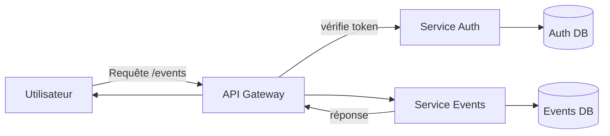

# Architecture Microservices

## Définition
Une architecture composée de plusieurs services autonomes, chacun responsable d'un domaine métier précis et communiquant par des API légères.

## Caractéristiques
- Services indépendants, déployables séparément
- Communication via API REST/HTTP ou messages
- Chaque service peut avoir sa propre base de données
- API Gateway possible pour routage, authentification et orchestration

## Schéma (Mermaid)

## Chemin: « Un utilisateur consulte la liste des événements »
1. L'utilisateur envoie GET `/events` à l'API Gateway.
2. L'API Gateway valide l'authentification (via le Service Auth ou token JWT).
3. La Gateway route la requête vers le Service Events.
4. Le Service Events interroge sa base de données (EventsDB) et renvoie la liste.
5. La Gateway renvoie la réponse au client.

## Avantages / Inconvénients (pour le mini-système d'événements)
- Avantages : possibilité de scaler indépendamment le service Events, déploiements ciblés, tolérance aux pannes locales.
- Inconvénients : complexité opérationnelle (orchestration, monitoring), latence réseau, gestion des transactions distribuées.

## Exemples d'utilisation
- Grandes applications distribuées, plateformes nécessitant scalabilité granulaire.

## Sources
- Notes de cours et documentation microservices.

## Structure et déploiement
- Conteneurs/Pods Docker pour chaque service (`auth`, `events`, `notifications`, `gateway`).
- Orchestration Kubernetes / Docker Compose pour développement.
- Bases de données séparées : `auth-db`, `events-db` (chaque service son modèle).

## Environnements hébergement
- API Gateway (Load Balancer / Cloud Gateway) en frontal
- Services déployés sur clusters (K8s, ECS) ou fonctions serverless
- Observabilité : centralisé (Prometheus, Grafana, ELK)

## Flux détaillés par fonctionnalité

1) Inscription (POST `/signup`)
	- Requête envoyée à `auth` via la Gateway.
	- `auth` valide et persiste l'utilisateur dans `auth-db`.
	- `auth` peut publier un événement `UserCreated` (optionnel).

2) Connexion (POST `/login`)
	- Requête vers `auth` qui valide et renvoie un token JWT.
	- Token utilisé pour appels ultérieurs vers `events` via la Gateway.

3) Création d'un événement (POST `/events`)
	- Client appelle `gateway` avec token.
	- Gateway route vers `events` service.
	- `events` persiste dans `events-db` et peut publier `EventCreated` pour autres services.

4) Listing des événements publics (GET `/events`)
	- Client appelle `gateway`.
	- Gateway authentifie (ou pas) et route vers `events`.
	- `events` retourne la liste depuis `events-db`.

5) Consultation d'un événement (GET `/events/{id}`)
	- Route via Gateway → `events.findById(id)` → `events-db` → réponse.

## Cohérence et transactions
- Transactions limitées au sein d'un service; pour opérations multi-services, utiliser sagas ou event-driven compensations.

## Avantages / Inconvénients techniques (plus de détails)
- Observabilité et traçage requis (Distributed Tracing)
- Tests d'intégration plus complexes (mocking de services)

